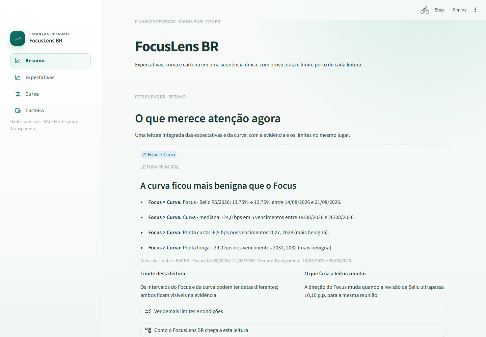
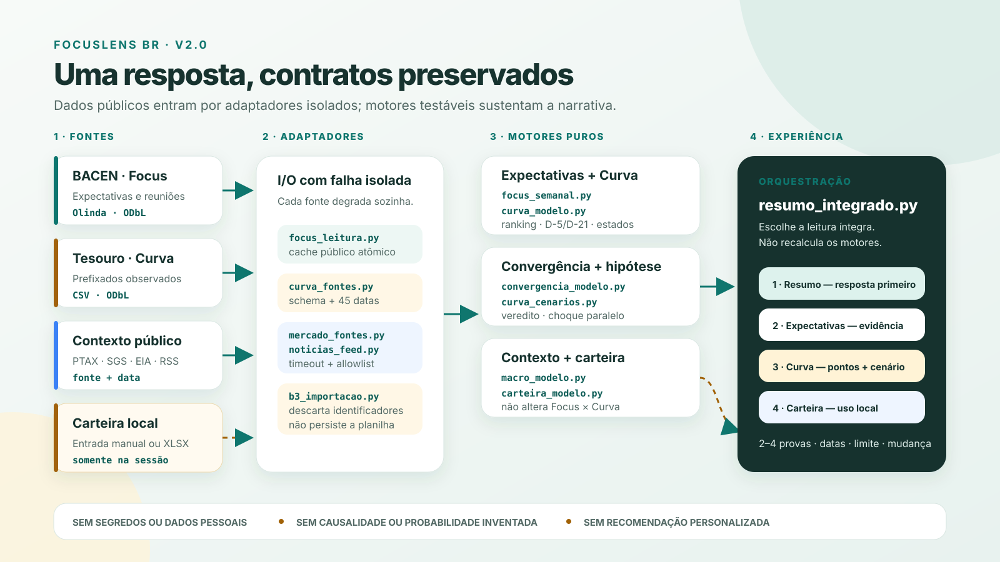
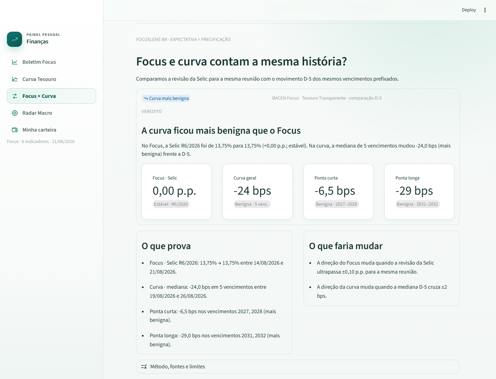
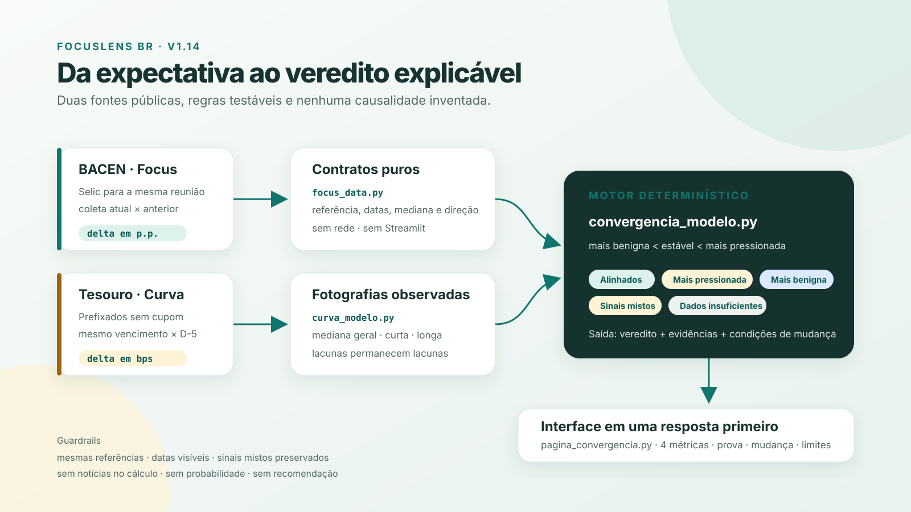

# FocusLens BR — inteligência de mercado para sua carteira

Produto pessoal de inteligência financeira. Os motores Python reúnem
**Boletim Focus**, Curva Tesouro, Focus × Curva, Radar Macro e carteira; o novo
app móvel transforma esses contratos na pergunta central: **o que o mercado
está dizendo e como isso afeta os investimentos que eu já tenho?**

O plano canônico do produto, com escopo, arquitetura, padrão visual, gates e
sequência de publicação, está em [`PLANO_FOCUSLENS.md`](PLANO_FOCUSLENS.md).

## FocusLens Mobile — contrato vivo

Em 2026-08-27, o Raul redirecionou o destino do produto para um app Android/iOS.
O diretório [`mobile/`](mobile/) contém o app React Native, Expo e TypeScript,
com quatro áreas:

- **Hoje:** sinais de Focus, curva, inflação e dólar, todos com data e fonte;
- **Carteira:** exposição, pesos e privacidade de valores;
- **Cenários:** sensibilidade de −100 a +100 bps;
- **Entenda:** Sinal → Evidência → Exposição → Limite.

Ao tocar em um sinal, o app filtra as posições relacionadas e explica somente
os efeitos que o motor Python já calculou. O contrato `v1` agora gera um JSON
público e versionado a partir dos caches locais de Focus e Curva, sem rede e
sem carteira. Um provider TypeScript valida esse documento antes do uso;
schema ausente, incompatível ou inválido ativa a fotografia sintética local e
identifica o fallback na tela.

A carteira continua deliberadamente sintética e separada do artefato público.
O provider combina mercado e posições apenas em memória, na borda da interface.


Detalhes de execução em [`mobile/README.md`](mobile/README.md) e da fronteira
técnica em [`docs/ARQUITETURA_MOBILE.md`](docs/ARQUITETURA_MOBILE.md).

## Visão institucional — FocusLens Embedded

O roadmap aprovado preserva o app pessoal como cliente de referência e, depois
dos gates móveis, transforma os mesmos motores em uma camada incorporável a
app, internet banking e plataforma de assessoria. A proposta não é vender um
painel de indicadores, mas entregar inteligência financeira explicável com
recibo auditável: sinal, evidência, fonte, exposição, limite, regra e versão.

O produto institucional planejado combina:

- Intelligence API e contratos versionados;
- Exposure Adapter executado na fronteira privada da instituição;
- alertas de carteira explicáveis;
- Governance Studio com aprovação, replay e kill switch;
- SDK white-label para os canais do banco;
- piloto controlado com métricas de adoção, retenção, eficiência, qualidade e
  risco.

A estratégia completa está em
[`docs/ESTRATEGIA_INSTITUCIONAL.md`](docs/ESTRATEGIA_INSTITUCIONAL.md). A
arquitetura-alvo, os contratos e os gates estão em
[`docs/ARQUITETURA_INSTITUCIONAL.md`](docs/ARQUITETURA_INSTITUCIONAL.md).
Nenhum desses componentes institucionais está implementado neste corte; o
próximo incremento continua sendo o development build da Etapa 5.

## v2.0 — release candidate

Os cinco incrementos do FocusLens BR `v2.0` estão concluídos tecnicamente. O
Resumo escolhe a prioridade já calculada pelos motores, mostra duas a quatro
provas, datas por fonte, limite e condição de mudança e, quando existe,
incorpora somente um sinal externo do Radar que acrescente contexto. Nenhuma
fórmula dos motores `v1.12`–`v1.14` foi duplicada.

A página agora segue Resumo → Expectativas → Curva → Carteira. O módulo visual
completo do Radar e a antiga apresentação de Focus × Curva continuam no código
e cobertos por testes durante a migração; o cenário completo do Radar segue
alimentando a Carteira. Na seção Curva, um choque paralelo de −100 a +100 bps
compara a fotografia observada com uma hipótese de deslocamento uniforme, sem
calcular probabilidade, preço ou retorno. A primeira dobra também explica, sob
demanda, por que a leitura atual lidera e o que fica fora do veredito.

O pacote final inclui captura, arquitetura, release notes, texto de LinkedIn e
auditoria de publicação. O repositório permanece privado: a tag/release `v2.0`
e a abertura pública aguardam a escolha da licença do código e a decisão sobre
o e-mail não mascarado presente no histórico Git.





## O que faz hoje

- Abre com “o que merece atenção agora?” e mantém prova, datas, fonte, limite
  e condição de mudança junto do veredito. O menu lateral leva a Resumo,
  Expectativas, Curva e Carteira sem trocar de rota.
- Busca Selic, IPCA, câmbio, PIB Total, IGP-M e dívida líquida do setor
  público direto da API pública do BACEN (Sistema de Expectativas de Mercado
  / Olinda), sem precisar de PDF nem chave de acesso.
- Verifica novas leituras automaticamente uma vez por dia útil. Na primeira
  execução, preenche até 12 semanas recentes para o gráfico já nascer útil;
  se o BACEN estiver indisponível, preserva e identifica a última coleta.
- Mantém o histórico atualizado no GitHub toda segunda-feira por uma rotina
  agendada, mesmo quando o app não é aberto.
- Abre com o **Focus Semanal**: ranqueia as três maiores revisões entre Selic,
  IPCA, câmbio e PIB, normalizadas pelo limiar de cada indicador. Valor atual,
  variação, datas e estado da coleta ficam junto da conclusão.
- Diferencia explicitamente leitura atualizada, defasada, indisponível ou sem
  mudança relevante; os demais indicadores e detalhes ficam sob demanda.
- A **Curva Tesouro** consulta o CSV público do Tesouro Transparente, isola
  títulos prefixados sem cupom e compara a curva atual com D-5 e D-21
  observações disponíveis. O resumo mostra variação mediana, pontas curta e
  longa e inclinação; gráfico e tabela preservam cada vencimento real.
- Mantém um cache público de 45 datas e o atualiza automaticamente em dias
  úteis pelo GitHub Actions. Falha da fonte não derruba as demais seções.
- Permite aplicar um choque paralelo ilustrativo à fotografia atual. Todos os
  vencimentos recebem o mesmo deslocamento em bps, então a inclinação fica
  inalterada por construção; gráfico, tabela e limites deixam explícito que o
  cenário não é previsão nem cálculo de retorno.
- O módulo **Focus × Curva** compara a revisão da Selic para a mesma reunião
  com a mediana D-5 dos vencimentos prefixados em comum. O resultado é um dos
  cinco estados explicáveis: alinhados, curva mais pressionada, curva mais
  benigna, sinais mistos ou dados insuficientes.
- Quando existem quatro ou mais vencimentos comparáveis, separa as pontas
  curta e longa. O veredito sempre mostra os números e datas que o sustentam,
  além das condições objetivas que fariam a leitura mudar.
- Separa contrato de dados, adaptador, motor, apresentação pura e interface;
  cálculos e semântica visual podem ser testados sem rede nem navegador.
- Permite explorar os impactos por classe de investimento e escolher qual
  série histórica visualizar; indicadores secundários, explicações e dados
  completos ficam disponíveis sob demanda.
- Mostra efeitos historicamente esperados por classe de investimento
  (pós-fixado, prefixado, IPCA+, bolsa, câmbio) — conteúdo educacional, não é
  recomendação personalizada.
- Reúne três manchetes relevantes de InfoMoney e Brazil Journal via RSS, com
  cache, deduplicação e fallback independente por fonte. O app exibe apenas
  título, fonte, horário e link para a publicação original.
- O **Radar Macro** combina Focus, dólar PTAX, petróleo Brent, Bitcoin e temas
  das manchetes em um cenário direcional de 4–12 semanas. No Resumo aparece
  no máximo um sinal externo não redundante, com fonte, horizonte e confiança;
  o cenário completo permanece disponível ao motor da Carteira — sem alvo de
  preço nem ordem de compra/venda.
- Compara dólar, Brent, Bitcoin, CDI e Selic desde o início do ano no mesmo
  gráfico de linhas em base 100, mantendo valor real, data da observação e
  tabela acessível sob demanda.
- Oferece um editor de carteira para informar ativo, classe, valor atual,
  valor investido e referência. Calcula alocação, concentração, resultado,
  comparação no ano e exposição ao cenário macro. Os valores ficam somente
  na sessão: não são gravados em arquivo nem enviados ao GitHub.
- Importa diretamente o XLSX de posição da Área do Investidor B3. O app
  descarta subtotais, consolida o mesmo ativo entre abas, classifica ações,
  ETFs, FIIs/FIAGRO, renda fixa e Tesouro e ignora conta, instituição, CNPJ,
  ISIN e contratos. A planilha é processada apenas em memória.

O ponto de entrada do método está em
[`METODOLOGIA_FOCUSLENS.md`](METODOLOGIA_FOCUSLENS.md). Os contratos
especializados permanecem em [`METODOLOGIA_FOCUS.md`](METODOLOGIA_FOCUS.md),
[`METODOLOGIA_CURVA.md`](METODOLOGIA_CURVA.md) e
[`METODOLOGIA_FOCUS_CURVA.md`](METODOLOGIA_FOCUS_CURVA.md), além de
[`METODOLOGIA_RADAR.md`](METODOLOGIA_RADAR.md).

### Marcos anteriores







Pacote da `v2.0`:

- [`docs/RELEASE_V2.0.md`](docs/RELEASE_V2.0.md);
- [`docs/AUDITORIA_PUBLICACAO_V2.0.md`](docs/AUDITORIA_PUBLICACAO_V2.0.md);
- [`docs/POST_LINKEDIN_FOCUSLENS_V2.0.md`](docs/POST_LINKEDIN_FOCUSLENS_V2.0.md).

Publicação anterior:
[`docs/POST_LINKEDIN_FOCUS_CURVA_V1.14.md`](docs/POST_LINKEDIN_FOCUS_CURVA_V1.14.md).

## Como rodar o app móvel

```powershell
cd mobile
npm ci
npm run web
```

A prévia imediata usa o renderer web da mesma base React Native. A configuração
do development build para SDK 57 está pronta e validada pelo Expo Doctor; a
geração/instalação do APK aguarda login EAS e aparelho Android. O bundle Android
continua no gate local:

```powershell
npm run typecheck
npm run test:domain
npm run export:android
```

O comando exato já validado no computador de trabalho, com Node portátil e
dependências fora do OneDrive, está em [`mobile/README.md`](mobile/README.md).
O roteiro de build, instalação, acessibilidade, offline e iOS está em
[`docs/VALIDACAO_DEVELOPMENT_BUILD.md`](docs/VALIDACAO_DEVELOPMENT_BUILD.md).

## Como rodar a referência Streamlit

Desde 2026-08-04 este projeto mora dentro do hub da Fits, que é uma pasta
sincronizada pelo OneDrive. **Crie o `.venv` fora dessa árvore** — instalar
pacotes com o `.venv` dentro de uma pasta sincronizada pode travar no meio
(o OneDrive intercepta rename/hardlink que o `pip` usa para instalar cada
wheel, e a instalação quebra com `AssertionError` ou termina faltando
módulo):

```
python -m venv "%USERPROFILE%\.venvs\financas-pessoais"
%USERPROFILE%\.venvs\financas-pessoais\Scripts\activate
pip install -r requirements.txt
streamlit run app_financas.py
```

(No PowerShell, ative com
`& "$env:USERPROFILE\.venvs\financas-pessoais\Scripts\Activate.ps1"`.) O
`cd` continua sendo a pasta deste projeto — só o `.venv` em si vive fora do
OneDrive.

O app abre em uma página única. Use o menu lateral para ir a **Resumo**,
**Expectativas**, **Curva** ou **Carteira**. Focus e Curva verificam
automaticamente se há dados novos; os dois também oferecem atualização manual.
Em **Carteira**, envie a planilha XLSX da B3 ou preencha as posições
manualmente; os dois caminhos permitem adicionar linhas para investimentos que
não estejam nessa fotografia.

## Trabalhando de mais de uma máquina (casa + trabalho)

O `.venv` é local a cada máquina (não é versionado — recrie com os passos
acima em cada lugar). Já os caches do Focus (`dados/focus_cache.json`) e da
Curva (`dados/curva_prefixada_cache.json`) **são versionados de propósito**:
contêm somente dados públicos e mantêm a mesma fotografia entre máquinas. As
rotinas em `.github/workflows/` atualizam o Focus semanalmente e a Curva em
dias úteis; por isso, faça `git pull` antes de trabalhar.

Rotina simples para não perder nada:

```
git pull                              # antes de abrir o app
streamlit run app_financas.py         # usa/atualiza o app normalmente
git add -A && git commit -m "..."     # depois de qualquer mudança (inclusive só o cache)
git push
```

O Claude Code lê `CLAUDE.md` e `CONTEXT.md` automaticamente em qualquer
máquina com o repositório clonado — é isso (não a conversa do chat) que
mantém o contexto entre casa e trabalho.

Para retomar o projeto em um chat novo, use o bloco **“Handoff para um novo
chat”** no início de [`CONTEXT.md`](CONTEXT.md). Ele registra o ponto exato da
entrega, as decisões preservadas e um prompt pronto; a ordem técnica da próxima
etapa permanece em [`PLANO_FOCUSLENS.md`](PLANO_FOCUSLENS.md).

## Roadmap

O produto mantém os quatro marcos dos motores e abre uma quinta etapa móvel no
mesmo repositório:

1. **Focus Semanal (`v1.12`, entregue)** — o que mudou nas expectativas;
2. **Curva Tesouro (`v1.13`, entregue)** — o que mudou nas taxas prefixadas;
3. **Focus × Curva (`v1.14`, entregue)** — expectativa versus precificação;
4. **FocusLens BR (`v2.0`, release candidate)** — experiência integrada,
   método e pacote de publicação;
5. **FocusLens Mobile (`v0.1` + contrato vivo `v1`, entregues)** — interface
   Android/iOS, fotografia pública, personalização por carteira sintética e
   cenários interativos;
6. **FocusLens Embedded (direção aprovada, não implementada)** — API, receipt,
   SDK, governança e piloto institucional depois da maturidade móvel.

Cada marco precisa funcionar sozinho, passar pelos gates técnico e visual e
gerar uma publicação própria. O escopo completo está em
[`PLANO_FOCUSLENS.md`](PLANO_FOCUSLENS.md); a sequência institucional começa na
seção 14 sem substituir a próxima execução da seção 13.

## Publicação e licença

A auditoria técnica da `v2.0` está em
[`docs/AUDITORIA_PUBLICACAO_V2.0.md`](docs/AUDITORIA_PUBLICACAO_V2.0.md). O
código ainda não possui uma licença explícita de reutilização; até o titular
escolher uma, todos os direitos permanecem reservados por padrão. A ausência de
um arquivo `LICENSE` é deliberadamente tratada como decisão pendente, não como
uma licença aberta implícita.

## Fonte oficial dos dados

BACEN — Sistema de Expectativas de Mercado (Boletim Focus), licença ODbL:
https://olinda.bcb.gov.br/olinda/servico/Expectativas/versao/v1/odata

Tesouro Transparente — taxas e preços do Tesouro Direto, licença ODbL 1.0:
https://www.tesourotransparente.gov.br/ckan/dataset/taxas-dos-titulos-ofertados-pelo-tesouro-direto

Demais séries do Radar:

- PTAX/BACEN:
  https://dadosabertos.bcb.gov.br/dataset/dolar-americano-usd-todos-os-boletins-diarios
- Brent/EIA via FRED:
  https://fred.stlouisfed.org/series/DCOILBRENTEU
- BTC/BRL/Binance:
  https://data-api.binance.vision
- Selic diária (SGS 11):
  https://dadosabertos.bcb.gov.br/dataset/11-taxa-de-juros---selic
- CDI diário (SGS 12):
  https://www3.bcb.gov.br/sgspub/consultarvalores/consultarValoresSeries.do?method=consultarSeries&series=12
