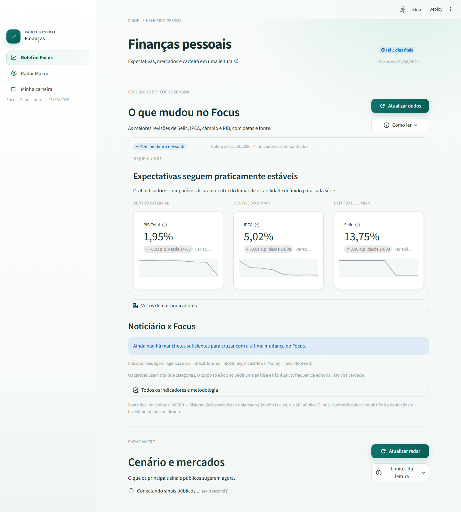
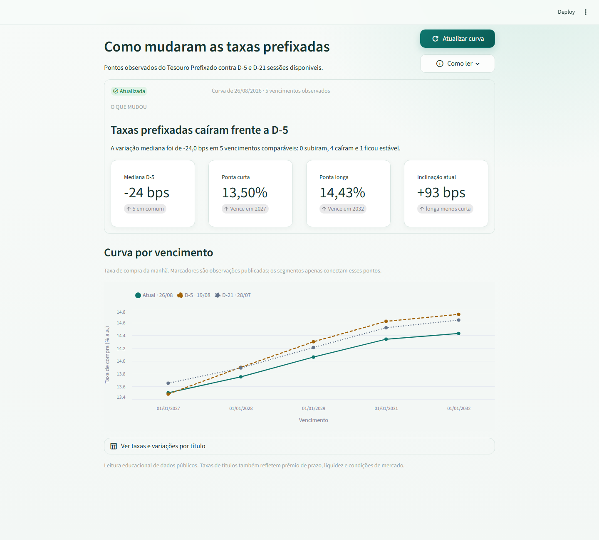
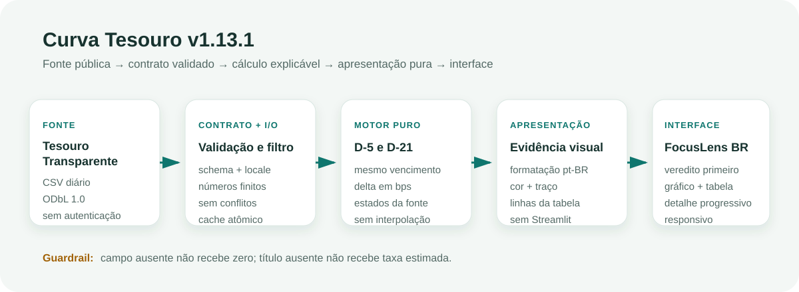

# Finanças Pessoais — base do FocusLens BR

App pessoal em Streamlit para aprender e acompanhar o mercado financeiro. A
base atual reúne **Boletim Focus**, Curva Tesouro, Radar Macro e carteira;
sua evolução aprovada é o **FocusLens BR**, que cruzará expectativas, curva
de juros e cenários em entregas pequenas e publicáveis.

O plano canônico do produto, com escopo, arquitetura, padrão visual, gates e
sequência de publicação, está em [`PLANO_FOCUSLENS.md`](PLANO_FOCUSLENS.md).

## O que faz hoje (v1.13.1)

- Reúne visão geral, Boletim Focus, Curva Tesouro, Radar Macro e carteira em
  uma única página. O menu lateral leva diretamente a cada seção sem trocar
  de rota.
- Busca Selic, IPCA, câmbio, PIB Total, IGP-M e dívida líquida do setor
  público direto da API pública do BACEN (Sistema de Expectativas de Mercado
  / Olinda), sem precisar de PDF nem chave de acesso.
- Verifica novas leituras automaticamente uma vez por dia útil. Na primeira
  execução, preenche até 12 semanas recentes para o gráfico já nascer útil;
  se o BACEN estiver indisponível, preserva e identifica a última coleta.
- Mantém o histórico atualizado no GitHub toda segunda-feira por uma rotina
  agendada, mesmo quando o app não é aberto.
- Abre com o **Focus Semanal**: ranqueia as três maiores revisões entre Selic,
  IPCA, câmbio e PIB, normalizadas pelo limiar de cada indicador. Valor atual,
  variação, datas e estado da coleta ficam junto da conclusão.
- Diferencia explicitamente leitura atualizada, defasada, indisponível ou sem
  mudança relevante; os demais indicadores e detalhes ficam sob demanda.
- A **Curva Tesouro** consulta o CSV público do Tesouro Transparente, isola
  títulos prefixados sem cupom e compara a curva atual com D-5 e D-21
  observações disponíveis. O resumo mostra variação mediana, pontas curta e
  longa e inclinação; gráfico e tabela preservam cada vencimento real.
- Mantém um cache público de 45 datas e o atualiza automaticamente em dias
  úteis pelo GitHub Actions. Falha da fonte não derruba as demais seções.
- Separa contrato de dados, adaptador, motor, apresentação pura e interface;
  cálculos e semântica visual podem ser testados sem rede nem navegador.
- Permite explorar os impactos por classe de investimento e escolher qual
  série histórica visualizar; indicadores secundários, explicações e dados
  completos ficam disponíveis sob demanda.
- Mostra efeitos historicamente esperados por classe de investimento
  (pós-fixado, prefixado, IPCA+, bolsa, câmbio) — conteúdo educacional, não é
  recomendação personalizada.
- Reúne três manchetes relevantes de InfoMoney e Brazil Journal via RSS, com
  cache, deduplicação e fallback independente por fonte. O app exibe apenas
  título, fonte, horário e link para a publicação original.
- O **Radar Macro** combina Focus, dólar PTAX, petróleo Brent, Bitcoin e
  temas das manchetes em um cenário direcional de 4–12 semanas. Mostra
  confiança, sinais, classes relativamente favorecidas/pressionadas e o que
  faria a leitura mudar — sem alvo de preço nem ordem de compra/venda.
- Compara dólar, Brent, Bitcoin, CDI e Selic desde o início do ano no mesmo
  gráfico de linhas em base 100, mantendo valor real, data da observação e
  tabela acessível sob demanda.
- Oferece um editor de carteira para informar ativo, classe, valor atual,
  valor investido e referência. Calcula alocação, concentração, resultado,
  comparação no ano e exposição ao cenário macro. Os valores ficam somente
  na sessão: não são gravados em arquivo nem enviados ao GitHub.
- Importa diretamente o XLSX de posição da Área do Investidor B3. O app
  descarta subtotais, consolida o mesmo ativo entre abas, classifica ações,
  ETFs, FIIs/FIAGRO, renda fixa e Tesouro e ignora conta, instituição, CNPJ,
  ISIN e contratos. A planilha é processada apenas em memória.

As metodologias e seus limites estão em
[`METODOLOGIA_FOCUS.md`](METODOLOGIA_FOCUS.md),
[`METODOLOGIA_CURVA.md`](METODOLOGIA_CURVA.md) e
[`METODOLOGIA_RADAR.md`](METODOLOGIA_RADAR.md).







## Como rodar

Desde 2026-08-04 este projeto mora dentro do hub da Fits, que é uma pasta
sincronizada pelo OneDrive. **Crie o `.venv` fora dessa árvore** — instalar
pacotes com o `.venv` dentro de uma pasta sincronizada pode travar no meio
(o OneDrive intercepta rename/hardlink que o `pip` usa para instalar cada
wheel, e a instalação quebra com `AssertionError` ou termina faltando
módulo):

```
python -m venv "%USERPROFILE%\.venvs\financas-pessoais"
%USERPROFILE%\.venvs\financas-pessoais\Scripts\activate
pip install -r requirements.txt
streamlit run app_financas.py
```

(No PowerShell, ative com
`& "$env:USERPROFILE\.venvs\financas-pessoais\Scripts\Activate.ps1"`.) O
`cd` continua sendo a pasta deste projeto — só o `.venv` em si vive fora do
OneDrive.

O app abre em uma página única. Use o menu lateral para ir ao **Boletim
Focus**, **Curva Tesouro**, **Radar Macro** ou **Minha carteira**. Focus e
Curva verificam automaticamente se há dados novos; os dois também mantêm um
botão de atualização manual. Em **Minha carteira**, envie a planilha XLSX da
B3 ou preencha as posições manualmente; os dois caminhos permitem adicionar
linhas para investimentos que não estejam nessa fotografia.

## Trabalhando de mais de uma máquina (casa + trabalho)

O `.venv` é local a cada máquina (não é versionado — recrie com os passos
acima em cada lugar). Já os caches do Focus (`dados/focus_cache.json`) e da
Curva (`dados/curva_prefixada_cache.json`) **são versionados de propósito**:
contêm somente dados públicos e mantêm a mesma fotografia entre máquinas. As
rotinas em `.github/workflows/` atualizam o Focus semanalmente e a Curva em
dias úteis; por isso, faça `git pull` antes de trabalhar.

Rotina simples para não perder nada:

```
git pull                              # antes de abrir o app
streamlit run app_financas.py         # usa/atualiza o app normalmente
git add -A && git commit -m "..."     # depois de qualquer mudança (inclusive só o cache)
git push
```

O Claude Code lê `CLAUDE.md` e `CONTEXT.md` automaticamente em qualquer
máquina com o repositório clonado — é isso (não a conversa do chat) que
mantém o contexto entre casa e trabalho.

## Roadmap

O produto será publicado em quatro marcos no mesmo repositório:

1. **Focus Semanal (`v1.12`, entregue)** — o que mudou nas expectativas;
2. **Curva Tesouro (`v1.13`, entregue)** — o que mudou nas taxas prefixadas;
3. **Focus × Curva (`v1.14`)** — expectativa versus precificação;
4. **FocusLens BR (`v2.0`)** — experiência integrada e demo pública.

Cada marco precisa funcionar sozinho, passar pelos gates técnico e visual e
gerar uma publicação própria. O escopo completo está em
[`PLANO_FOCUSLENS.md`](PLANO_FOCUSLENS.md).

## Fonte oficial dos dados

BACEN — Sistema de Expectativas de Mercado (Boletim Focus):
https://olinda.bcb.gov.br/olinda/servico/Expectativas/versao/v1/odata

Tesouro Transparente — taxas e preços do Tesouro Direto, licença ODbL 1.0:
https://www.tesourotransparente.gov.br/ckan/dataset/taxas-dos-titulos-ofertados-pelo-tesouro-direto

Demais séries do Radar:

- PTAX/BACEN:
  https://dadosabertos.bcb.gov.br/dataset/dolar-americano-usd-todos-os-boletins-diarios
- Brent/EIA via FRED:
  https://fred.stlouisfed.org/series/DCOILBRENTEU
- BTC/BRL/Binance:
  https://data-api.binance.vision
- Selic diária (SGS 11):
  https://dadosabertos.bcb.gov.br/dataset/11-taxa-de-juros---selic
- CDI diário (SGS 12):
  https://www3.bcb.gov.br/sgspub/consultarvalores/consultarValoresSeries.do?method=consultarSeries&series=12
