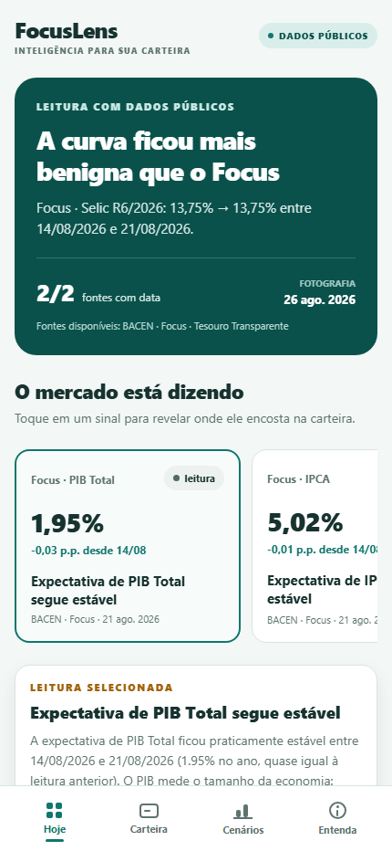

# FocusLens Mobile

App móvel do FocusLens BR em React Native, Expo e TypeScript. A
experiência responde a uma pergunta simples: **o que o mercado está dizendo e
onde isso encosta na minha carteira?**



## O que já funciona

- **Hoje:** recorte pessoal com quantidade de posições/classes, concentração,
  cobertura real dos sinais e acesso direto à carteira;
- **origem explícita:** “Dados públicos” quando o contrato vivo é válido e
  “Demonstração” quando o provider precisa usar o fallback local;
- **impacto sem falsa precisão:** cada sinal revela somente relações já
  declaradas pelo motor; quando não há efeito por classe, o limite fica visível;
- **Carteira:** criação, edição e exclusão de posições locais, distribuição por
  classe, lista progressiva, peso por posição e controle para ocultar valores;
- **cofre privado nativo:** chave no SecureStore e documento `v1` cifrado com
  AES-256-GCM no diretório persistente do app;
- **entrada pessoal direta:** na demonstração, importar a carteira B3 é o
  caminho principal e adicionar manualmente permanece como alternativa;
- **importação B3 local:** seletor XLSX, sanitização, prévia e substituição
  explícita da carteira sem upload do arquivo;
- **Cenários:** hipótese de −100 a +100 bps, leitura rápida por tom, cobertura
  explícita e detalhe progressivo por posição;
- **laboratório do dinheiro:** crescimento com juros compostos, meta ao
  contrário, custo de esperar, inflação, hábito recorrente e desafio de
  intuição, sempre com hipóteses escolhidas pela pessoa;
- **modo discreto da sessão:** ocultar valores em Carteira também mascara Hoje
  e Cenários até o app ser reiniciado;
- **Entenda contextual:** revisão semanal opcional em cinco passos, ligada ao
  sinal escolhido, à comparação literal, à carteira em memória e a Cenários;
- navegação inferior persistente, alvos de toque de pelo menos 44 px, tema
  claro e nenhuma informação transmitida somente por cor.

O mercado vem de `src/data/liveSnapshot.json`, gerado pelos motores Python a
partir dos caches públicos versionados. O JSON público não contém posição,
quantia ou identificador pessoal. No Android/iOS, uma carteira criada pelo
usuário fica criptografada somente no aparelho; até o primeiro salvamento, o app
usa posições sintéticas claramente rotuladas. O app não conecta conta,
corretora ou Open Finance, não sincroniza carteira e não produz recomendação.

## Como a carteira local é protegida

- a demo nunca é persistida automaticamente;
- a chave AES de 256 bits fica no cofre nativo do sistema;
- o documento privado `v1` fica cifrado com AES-GCM e contexto autenticado;
- a gravação usa arquivo temporário e substituição do destino;
- chave ausente, arquivo alterado ou schema inválido bloqueiam a carteira sem
  misturar a demo;
- “Apagar carteira local” remove arquivo e chave após confirmação;
- a planilha B3 é copiada para o cache privado apenas durante a leitura, tem
  limite de 5 MB e é descartada antes da prévia;
- somente ativo, classe e valor entram na prévia; conta, CPF e colunas não
  necessárias não são interpretados nem armazenados;
- a bancada web continua somente em demonstração e não oferece falsa
  persistência segura.

O corte não usa biometria, nuvem, autenticação ou telemetria financeira. Troca
de aparelho e restauração de backup não são prometidas nesta versão.

## Acompanhamento explicável `v0.5.0`

A primeira entrega da Etapa 5C adiciona continuidade sem transformar o app em
plataforma de recomendação:

- até oito fotografias públicas `v1` ficam em um histórico JSON local;
- a comparação usa somente IDs, valores e textos literais já validados;
- nenhuma posição ou quantia entra nesse histórico;
- favoritos guardam somente IDs de sinais no cofre nativo;
- no renderer web ou em falha do storage, favoritos duram apenas na sessão e
  essa limitação fica visível;
- o detalhe selecionado separa o que mudou, o que prova, onde afeta e o que não
  prova;
- `effects` vazio continua significando relação não classificada, sem inferência
  criada no TypeScript.

O histórico é atualizado apenas quando `generatedAt` muda e mantém as oito
fotografias mais recentes. A versão é `0.5.0`, Android `versionCode 9` e iOS
`buildNumber 9`.

## Simulador local de aportes `v0.5.1`

Na aba Cenários, a pessoa pode informar um valor hipotético e escolher a classe
que o receberia. O app compara o total e os pesos por classe antes/depois,
inclusive quando a classe ainda não existe na carteira ou a carteira está vazia.

O formulário não oferece valor ou classe padrão. O resultado existe somente na
memória da tela, é descartado quando a hipótese muda e não escreve no cofre, no
histórico público ou em qualquer serviço. A conta não estima retorno, risco,
imposto, ativo, produto ou ordem. A versão é `0.5.1`, Android `versionCode 10` e
iOS `buildNumber 10`.

## Cobertura automatizada `v0.5.2`

A suíte móvel está separada por responsabilidade:

- `tests/domain/`: 42 testes de contratos e funções puras em `node:test`;
- `tests/components/`: 6 testes com `jest-expo` e React Native Testing Library;
- `tests/e2e/`: 4 contratos que evitam divergência entre app e Maestro;
- `e2e/maestro/flows/`: duas jornadas nativas para navegação e simulador.

Os fluxos usam somente os seletores registrados em
`src/testing/testIds.json`. Jest, Testing Library e seus tipos ficam em
`devDependencies`; não entram como dependência de runtime. A versão é `0.5.2`,
Android `versionCode 11` e iOS `buildNumber 11`.

```powershell
npm test
npm run e2e:maestro # requer Maestro e um binário instalado
npm run e2e:maestro:check:windows # valida o ambiente portátil e os YAMLs
npm run e2e:maestro:windows # exige Android autorizado e build 0.5.2/11
```

Os testes automatizados locais passaram, mas os fluxos Maestro ainda precisam
ser executados em Android/iOS. Os YAMLs passaram no Maestro `2.9.0`; o runner
Windows bloqueou corretamente antes das jornadas porque não havia Android
conectado. O
[preview EAS `v0.5.2`](https://expo.dev/accounts/raulsallesr/projects/focuslens-br/builds/c08e5397-427f-42c2-a163-ab5cd815cb55)
e seu [APK direto](https://expo.dev/artifacts/eas/dvVgjSbINj4f3OdJ4CJXx_O651PcG-llvTyurlh0Ytc.apk)
foram gerados no build `11`. O Raul confirmou a instalação no aparelho em
2026-08-31; o ADB não encontrou dispositivo conectado para conferir
package/versão, e os gates físicos continuam pendentes.

No Windows, `scripts/run-maestro-windows.ps1` procura Java, Maestro e ADB em
`%LOCALAPPDATA%\focuslens-tools`, sem alterar o `PATH` global. Antes do E2E, ele
confere a autorização USB, o package `com.raulsallesr.focuslens` e a versão
nativa declarada em `app.json`; um APK antigo é recusado explicitamente.
Os fluxos atuais iniciam com `clearState: true` e apagam o estado local do app.
Não os execute em uma carteira que precise ser preservada; use uma instalação
de demonstração descartável ou uma futura variante não destrutiva.

## Revisão guiada da semana `v0.5.3`

A Home oferece “Revisar a semana” depois da fotografia e do histórico, sem
tirar o recorte pessoal do topo. A sequência usa o sinal escolhido em Hoje e
abre um passo por vez em Entenda:

1. o que mudou literalmente entre fotografias;
2. qual número, movimento, fonte e data sustentam a leitura;
3. onde os `effects` já recebidos encontram as posições em memória;
4. o que explorar em Cenários por escolha da pessoa;
5. o que a leitura não prova.

Favoritos aparecem como contexto, mas não mudam o conteúdo do sinal. Sem duas
fotografias públicas, o primeiro passo declara que ainda não há comparação; sem
efeito, a revisão preserva a relação vazia. A ida a Cenários não preenche valor,
classe ou choque e oferece retorno explícito para fechar o limite. Todo o
progresso vive apenas em `App.tsx` e é descartado ao reiniciar o app.

A explicação geral de Entenda foi preservada sob revelação progressiva. A
versão é `0.5.3`, Android `versionCode 12` e iOS `buildNumber 12`; nenhum
storage, snapshot, motor, dependência ou rede foi alterado.

TypeScript, 42 testes de domínio, 10 de componentes, 4 contratos E2E e o
export Android/Hermes com 651 módulos passaram. A jornada completa foi
percorrida em 375×812, 430×932, 768×1024 e 844×390, sem overflow horizontal
nem alvo visível abaixo de 44 px. Isso é evidência local; não substitui os
gates físicos pausados.

Os checklists físicos continuam preservados, porém pausados por decisão de
produto enquanto a utilidade melhora. O escopo entregue está nas seções 24 a 35 de
[`PLANO_FOCUSLENS.md`](../PLANO_FOCUSLENS.md).

## Laboratório do dinheiro `v0.5.4` a `v0.6.4`

O laboratório abre a aba Cenários por perguntas que uma pessoa iniciante
consegue reconhecer antes de entrar na leitura da carteira:

1. **Quanto vira? (`v0.5.4`)** — combina valor inicial, aporte mensal, taxa
   efetiva anual e prazo. O resultado separa o que a pessoa colocou do que veio
   dos juros e mostra marcos ao longo do tempo;
2. **Quanto guardar? (`v0.5.5`)** — parte de uma meta e calcula o aporte mensal
   compatível com a taxa fixa informada;
3. **E se eu esperar? (`v0.5.5`)** — compara começar agora com esperar um, três
   ou cinco anos, deixando explícitos aportes pulados e tempo menor de
   capitalização;
4. **Um hábito no tempo (`v0.5.6`)** — converte uma recorrência diária, semanal
   ou mensal em equivalente médio por mês, sem classificar o gasto como certo
   ou errado;
5. **O que pesa mais? (`v0.5.6`)** — pede um palpite antes de comparar mais
   1 p.p. de taxa com mais R$ 150 por mês;
6. **O poder do tempo (`v0.5.7`)** — calcula quando o valor inicial dobra com e
   sem aportes, localiza R$ 10 mil, R$ 50 mil e R$ 100 mil e oferece uma régua
   tocável de 1 a 50 anos com controles menos/mais;
7. **Dinheiro que entra (`v0.5.8`)** — mostra a taxa mensal equivalente e o
   efeito de um aporte extra hoje ou repetido ao fim de cada ano;
8. **Minha segurança (`v0.5.9`)** — traduz reserva atual em meses de gasto
   essencial e calcula o caminho mecânico para uma meta de três, seis ou doze
   meses, sem atribuir rendimento;
9. **Compare completo (`v0.6.0`)** — põe sem aporte/com aporte lado a lado e
   revela inflação e custo anual hipotético somente sob ação explícita;
10. **A vida acontece (`v0.6.2`)** — compara o aporte fixo com aumento anual e
    uma pausa opcional no meio do prazo, separando aportes feitos e pulados;
11. **Parcelado sem mistério (`v0.6.3`)** — soma as parcelas, compara com o
    preço à vista e traduz o custo implícito sem escolher a forma de pagamento;
12. **Quanto tempo dura? (`v0.6.4`)** — simula retiradas ao fim de cada mês,
    mostra até onde o saldo chega e oferece reajuste anual opcional da retirada.

Desde `v0.6.1`, Cenários começa por três intenções e mostra somente uma família
do laboratório por vez. Isso reduz a tela inicial sem remover ferramentas. A
intenção escolhida também pertence à `MoneyLabSession` e desaparece ao reiniciar.

Em “Quanto vira?”, a inflação é um detalhe opcional: quando ligada, o app mostra
também o valor futuro em dinheiro do início do cenário. A taxa anual é
convertida para uma taxa mensal equivalente e os aportes entram ao final de
cada mês. Nenhum desses números vem da carteira, do snapshot ou de uma
instituição; o exemplo inicial é fictício e editável.

O estado completo do laboratório vive em `App.tsx`, permanece ao trocar de aba
e desaparece ao reiniciar o app. Nada entra no cofre, no histórico, nos
favoritos, no filesystem ou na rede. O modo discreto mascara entradas e
resultados monetários. Cada resultado declara que taxa constante não prova
retorno futuro, adequação, produto ou atingimento de meta. Custo é apenas uma
redução matemática de taxa; não representa tributo ou taxa real de produto.

O primeiro corte consolidado do laboratório foi `v0.5.6`, Android
`versionCode 15` e iOS `buildNumber 15`.
Passaram TypeScript, 51 testes de domínio, 16 de componentes, 4 contratos E2E e
o export Android/Hermes com 653 módulos. As cinco experiências foram percorridas
em 375×812, 430×932, 768×1024 e 844×390: não houve overflow horizontal nem alvo
interativo visível abaixo de 44 px. A inspeção é local; não substitui TalkBack,
texto ampliado ou os demais gates físicos pausados. Nenhum preview EAS ou
Maestro foi executado para estes três incrementos.

O segundo corte consolidado foi `v0.6.0`, Android `versionCode 19` e iOS
`buildNumber 19`.
`v0.5.7/16`, `v0.5.8/17` e `v0.5.9/18` são marcos lógicos do mesmo corte, sem
build EAS intermediário. Passaram TypeScript, 61 testes de domínio, 22 de
componentes, 4 contratos E2E e o export Android/Hermes com 654 módulos. As
quatro trilhas novas foram percorridas em 375×812, 430×932, 768×1024 e 844×390:
documento, body e painel mantiveram a largura do viewport e nenhum alvo
interativo visível ficou abaixo de 44 px. A validação continua local; TalkBack,
texto ampliado e os gates físicos seguem pendentes. Nenhum preview EAS ou
Maestro foi executado para `v0.5.7`–`v0.6.0`.

O corte atual é `v0.6.4`, Android `versionCode 23` e iOS `buildNumber 23`.
Passaram TypeScript, 70 testes de domínio, 33 de componentes, 4 contratos E2E
e o export Android/Hermes com 656 módulos. As três famílias e as três contas de
vida real foram percorridas em 375×812, 430×932, 768×1024 e 844×390 com
movimento reduzido, sem overflow horizontal ou alvo interativo visível abaixo
de 44 px. A inflação opcional e a parte inferior do resultado também foram
inspecionadas. O primeiro export e o primeiro Playwright reproduziram os
bloqueios conhecidos `spawn EPERM` e `WinError 5` no sandbox; ambos passaram
fora dele, sem mudança funcional. Nenhum preview EAS, Maestro ou gate físico
foi executado para `v0.6.1`–`v0.6.4`.

## Como atualizar a fotografia pública

Na raiz do projeto, usando o `.venv` externo já documentado:

```powershell
$pythonProjeto = "$env:USERPROFILE\.venvs\financas-pessoais\Scripts\python.exe"
& $pythonProjeto gerar_mobile_snapshot.py
```

O comando lê somente `dados/focus_cache.json` e
`dados/curva_prefixada_cache.json`; não consulta rede. A gravação usa UTF-8,
ordenação estável, newline final e substituição atômica. Se o conteúdo público
não mudou, o gerador preserva `generatedAt` e não cria diff de relógio. Para
reproduzir um diagnóstico de defasagem em uma data específica, use
`--reference-date AAAA-MM-DD`.

## Como visualizar agora

Pré-requisito: Node.js LTS.

```powershell
cd mobile
npm ci
npm run web
```

Esse comando abre a mesma árvore de componentes React Native no renderer web e
é o caminho imediato para revisar a experiência. O produto continua sendo
React Native; o renderer web é somente uma bancada de desenvolvimento.

### Atalho validado nesta máquina

No computador de trabalho, o Node portátil e as dependências externas ao
OneDrive já estão preparados. Abra um PowerShell novo e cole:

```powershell
$nodeRoot = "$env:LOCALAPPDATA\focuslens-tools\node-v24.20.0-win-x64"
$env:Path = "$nodeRoot;$env:Path"
$mobileRoot = Join-Path $env:USERPROFILE "OneDrive - FitBank Pagamentos Eletrônicos\Documentos\AI-Handoff-Hub-Starter\01_Projetos\Financas-Pessoais\mobile"
Set-Location -LiteralPath $mobileRoot
npm run web
```

Se o navegador não abrir sozinho, use o endereço exibido pelo Expo no terminal,
normalmente `http://localhost:8081`. `Ctrl+C` encerra o servidor. Essas linhas
precisam ser executadas na mesma janela do PowerShell para que o `npm` portátil
permaneça no `PATH`.

Nesta máquina, `mobile/node_modules` é uma junção local ignorada pelo Git para
`%LOCALAPPDATA%\focuslens-mobile\development\node_modules`. Não remover ou
versionar essa junção. Em outra máquina, prefira um clone curto, como
`C:\dev\financas-pessoais`, e então rode `npm ci` dentro de `mobile/`.

## Como rodar em um aparelho

Este corte usa Expo SDK 57. Para um projeto de produto, o caminho recomendado é
um **development build** próprio, não depender do aplicativo genérico Expo Go.
`eas.json`, `expo-dev-client`, identificadores Android/iOS, safe areas, rotação
e splash nativo já estão configurados. Em 2026-08-28, o projeto
`@raulsallesr/focuslens-br` foi vinculado e os primeiros APKs `development` e
`preview` foram gerados e instalados no POCO X8 Pro pela rota de link EAS. O preview
aprovou as quatro abas, o snapshot empacotado e a reabertura em modo avião.
Nesta máquina, Temurin `17.0.20.1`, Maestro `2.9.0` e ADB `37.0.1` estão em
`%LOCALAPPDATA%\focuslens-tools`, sem alteração do `PATH` global.

Para reproduzir os builds depois de autenticar localmente, sem enviar credencial
pelo chat:

```powershell
npx --yes eas-cli@23.0.0 login
npx --yes eas-cli@23.0.0 init
npx --yes eas-cli@23.0.0 build --platform android --profile development
```

Depois que o development APK estiver instalado, inicie o Metro com:

```powershell
npm run start:dev-client
```

O perfil `preview` gera um APK interno com bundle incorporado para o teste de
abertura offline; não publica em loja. Os IDs, links temporários, instalação,
checklist Android, rota iOS, evidências e limites estão em
[`docs/VALIDACAO_DEVELOPMENT_BUILD.md`](../docs/VALIDACAO_DEVELOPMENT_BUILD.md).

O corte `v0.4.0` adicionou o seletor nativo de documentos ao cofre já existente;
portanto exige um novo APK. O preview anterior continua válido para o fluxo
público/offline, mas não contém a importação B3. O
[preview `v0.3.0`](https://expo.dev/accounts/raulsallesr/projects/focuslens-br/builds/67b97c57-ce20-4cb6-8c21-570c4742762e)
foi concluído em 2026-08-28. O
[preview `v0.4.0`](https://expo.dev/accounts/raulsallesr/projects/focuslens-br/builds/c7695638-2f38-42a4-af07-92303f2a5ce0)
e seu [APK direto](https://expo.dev/artifacts/eas/25BWk8wQe0mppgR7jumlP4VdI99WJctpNg_Nwjf5Cec.apk)
foram instalados no POCO X8 Pro com Android 16. BI-01 a BI-03 e CL-02 a CL-10
foram aprovados. Os cortes `v0.4.1` a `v0.4.4`, agora no build `8`, reorganizam
a experiência para utilidade cotidiana: a Home começa pela carteira, resume
concentração e cobertura, enquanto a Carteira oferece importação B3 antes do
exemplo fictício. O
[preview `v0.4.4`](https://expo.dev/accounts/raulsallesr/projects/focuslens-br/builds/6199d700-82ca-44df-8ede-6987679c2566)
foi concluído em 2026-08-31 e o
[APK direto](https://expo.dev/artifacts/eas/u_SIGIlaaIXgDgQYRd_qNcSgVPPUo7bOdm-TD8k1HNk.apk)
expira em 2026-09-14. Esse corte não foi avaliado separadamente e foi sucedido
pelo `v0.5.2/11`; os demais gates físicos estão pausados, não aprovados.

O corte completo da Etapa 5C está no
[preview `v0.5.2`](https://expo.dev/accounts/raulsallesr/projects/focuslens-br/builds/c08e5397-427f-42c2-a163-ab5cd815cb55),
build `11`, commit `1c477f5`. O
[APK direto mais recente](https://expo.dev/artifacts/eas/dvVgjSbINj4f3OdJ4CJXx_O651PcG-llvTyurlh0Ytc.apk)
expira em 2026-09-14 e teve a instalação por cima do app confirmada pelo Raul.
Como o aparelho não estava conectado ao ADB, a versão instalada e as jornadas
não foram verificadas; nenhum gate físico foi aprovado apenas pelo relato de
instalação.

Se o checkout estiver dentro de OneDrive e a instalação encontrar limites de
caminho, prefira um clone local curto para o desenvolvimento móvel. Nesta
máquina, as dependências foram mantidas fora do OneDrive e ligadas por um
`node_modules` local ignorado pelo Git.

## Gates

```powershell
npm run typecheck
npm test
npm run export:android
```

O gate de domínio cobre contrato demo, público e privado, schema incompatível,
documento inválido, proibição de carteira no artefato público, valores e campos
do editor, duplicidade, limite de posições, UTF-8, fallback, cálculo de peso,
distribuição por classe, maior posição derivada, cobertura honesta dos sinais,
resumo de cenário por tom e parcela não coberta, filtro por classe, impacto por
sinal, configuração EAS/SecureStore, snapshot empacotado, limites do cenário,
parser B3, ZIP/XML malformado, macro, tamanho,
classes não cobertas e linguagem não imperativa. A camada de componentes cobre
navegação, validação, comparação, descarte de resultado obsoleto, modo discreto,
coexistência entre aporte e sensibilidade e a revisão guiada com estados sem
histórico ou sem efeito. Também cobre o laboratório, a inflação opcional, a
navegação entre as famílias, o palpite antes do desafio, aportes crescentes,
pausa sem reposição e parcelamento com ou sem taxa positiva implícita. Os
contratos E2E conferem app ID, seletores e ausência de dado pessoal. O bundle
Android é gerado pelo Metro sem depender do Streamlit.

## Estrutura

```text
App.tsx                 estado e navegação principal
src/components/         componentes móveis reutilizáveis
src/data/               snapshot vivo, validação/provider e fallback demo
src/domain/             contratos, parser B3, filtros e sensibilidade
src/screens/            Hoje, Carteira, Cenários e Entenda
src/storage/            cofre local criptografado para Android/iOS
src/testing/            mapa canônico de seletores para Jest e Maestro
assets/                 marca determinística em SVG e PNG
tests/domain/           contratos e funções puras
tests/components/       renderização e interação React Native
tests/e2e/              contratos dos fluxos nativos
e2e/maestro/flows/      jornadas Android/iOS executáveis
```

Na raiz, `mobile_snapshot.py` adapta os quatro contratos Python sem alterar os
motores; `gerar_mobile_snapshot.py` é a entrada local de geração. O app importa
o JSON como recurso read-only, valida o schema `1` e só então combina os sinais
com `demoSnapshot.ts` em memória.

A arquitetura e a fronteira entre os motores Python e o app estão em
[`docs/ARQUITETURA_MOBILE.md`](../docs/ARQUITETURA_MOBILE.md).
O roteiro físico do editor/cofre `v0.3.0` está em
[`docs/VALIDACAO_CARTEIRA_LOCAL.md`](../docs/VALIDACAO_CARTEIRA_LOCAL.md).
O roteiro da importação `v0.4.0` está em
[`docs/VALIDACAO_IMPORTACAO_B3.md`](../docs/VALIDACAO_IMPORTACAO_B3.md).

## Relação com o produto institucional

Este app é o cliente de referência da futura camada **FocusLens Embedded**. Ele
não consome hoje API bancária, Open Finance, autenticação institucional ou
carteira em nuvem. A estratégia aprovada está em
[`docs/ESTRATEGIA_INSTITUCIONAL.md`](../docs/ESTRATEGIA_INSTITUCIONAL.md) e a
arquitetura-alvo em
[`docs/ARQUITETURA_INSTITUCIONAL.md`](../docs/ARQUITETURA_INSTITUCIONAL.md).
O desenvolvimento local entrou na Etapa 5C por decisão explícita do Raul em
2026-08-31. Histórico público, favoritos, alertas explicáveis, simulador por
classe, revisão guiada e o laboratório educacional formam a `v0.6.4`; os
fluxos E2E nativos ainda aguardam execução. Os gates de importação, TalkBack,
texto ampliado e alvos de toque continuam pausados e pendentes. A Etapa 6 e a
camada institucional não foram antecipadas.
